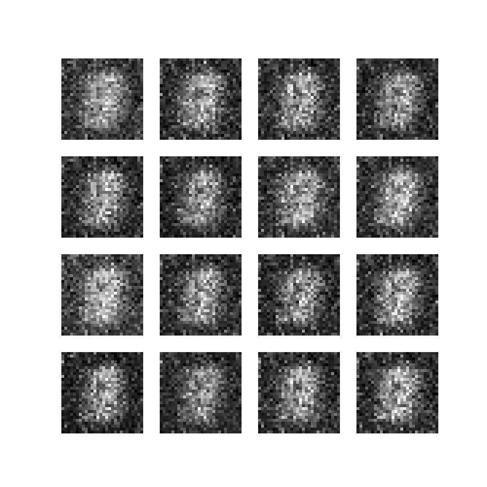

# Vanilla GAN

**Vanilla GAN** is a PyTorch implementation of a Generative Adversarial Network trained on the MNIST digit dataset. The project provides lightweight scripts for data preparation and model training along with a configuration file for customizing hyper‑parameters.

## Features
- **Configurable Training** – main parameters such as number of epochs, batch size and learning rate are defined in `config.yaml`:
  ```yaml
  NUM_EPOCHS: 50
  NOISE_DIMENSION: 50
  BATCH_SIZE: 128
  TRAIN_ON_GPU: True
  PRINT_STATS_AFTER_BATCH: 50
  OPTIMIZER_LR: 0.0002
  OPTIMIZER_BETAS: [0.5, 0.999]
  GENERATOR_OUTPUT_IMAGE_SHAPE: 784
  ```
- **Automatic Dataset Download** – the `prepare_dataset` function downloads MNIST and returns a `DataLoader` with normalized tensors.
- **Simple Network Architecture** – generator and discriminator are built from fully connected layers.
- **Training Utilities** – images and model checkpoints are saved for each run under `data/runs/UNIQUE_RUN_ID`.
- **Developer Tools & CI** – linting with ruff and black, end‐to‐end smoke test in GitHub Actions

> This repository is the PyTorch implementation of my blog post on the original GAN paper.
> [The Easiest Guide to Understanding the Original GAN Paper, Actually!](https://codinglabsong.medium.com/the-easiest-guide-to-understand-the-original-gan-paper-actually-6f874765579c)

## Installation
1. Install the core dependencies:
   ```bash
   pip install -r requirements.txt
   ```
2. (Optional) install development tools and pre‑commit hooks:
   ```bash
   pip install -r requirements-dev.txt
   pre-commit install
   pre-commit run --all-files
   ```
3. Install the package in editable mode:
   ```bash
   pip install -e .
   ```

## Training
To start training with the default configuration run:
```bash
bash scripts/run_train.sh
```
This script calls `python -m vanilla_gan.train` which handles dataset preparation, model initialization and epoch loops.
Hyper‑parameters may be adjusted by editing `config.yaml`.

### Model Progress

**Epoch0 Batch0**


**Epoch0 Batch200**



**Epoch1 Batch100**


**Epoch2 Batch350**


**Epoch4 Batch200**


**Epoch13 Batch450**


**Epoch26 Batch150**


## Repository Structure
- `src/vanilla_gan/` – core modules with data loading, model definitions and training logic.
- `data/` – where datasets and runs would be generated
- `scripts/` – helper script for launching training.
- `notebooks/` – Jupyter notebook used for early experiments.

## Requirements
- Python >= 3.10
- PyTorch
- torchvision
- matplotlib

## Contributing

Contributions are welcome! Feel free to open issues or submit pull requests.

## Acknowledgements

- [Building a Vanilla GAN with Pytorch](https://medium.com/codex/building-a-vanilla-gan-with-pytorch-ffdf26275b70)

## License
This project is released under the MIT License.
